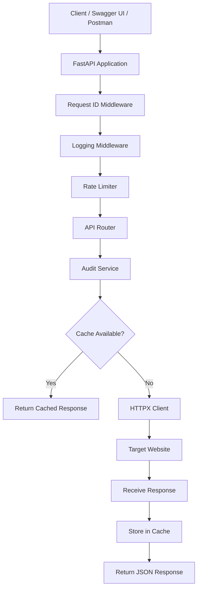

# Architecture Diagram

```mermaid
flowchart TD

A[Client / Swagger UI / Postman]

A --> B[FastAPI Application]

B --> C[Request ID Middleware]
C --> D[Logging Middleware]
D --> E[Rate Limiter]

E --> F[API Router]

F --> G[Audit Service]

G --> H{Cache Available?}

H -- Yes --> I[Return Cached Response]

H -- No --> J[HTTPX Client]

J --> K[Target Website]

K --> L[Receive Response]

L --> M[Store in Cache]

M --> N[Return JSON Response]
```